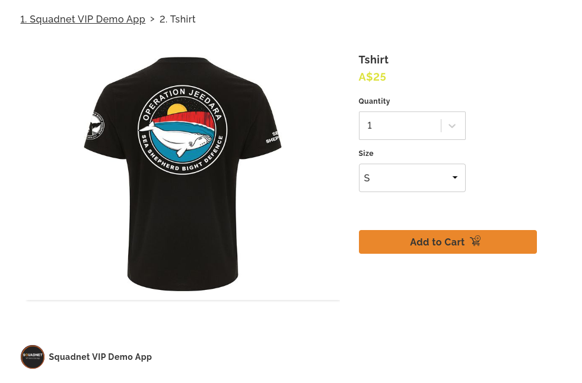
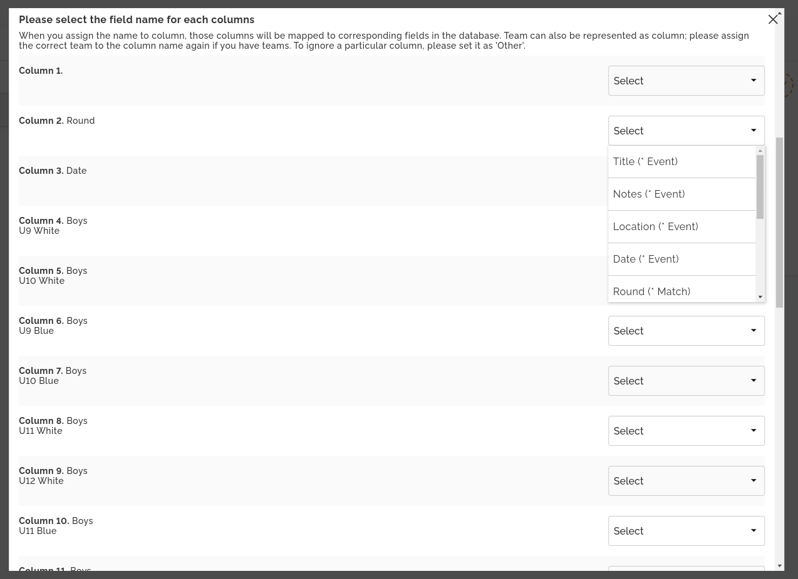

# Squadnet Fullstack Test 

## Problem
Please choose to solve one problem below that you find interesting.

### 1. Ecommerce / Ticketing
#### Problem statement
As a club, I want to sell my event tickets to both existing memberships and public users. We have limited spots and want to give our members purchase priority with discount.

#### Domain context
Ticket is one type of product that is linked to event. Club can add one or more product options, each options have their own variant and each variant can have their own pricing.
For instance, a ticket to football match have VIP seat (extra $2), and normal seat in seat options. Club also set t-shirt with size S, M, L and two colors blue and red. Your solution should cover these cases.

#### Your tasks
- Design database models for product based on following [JSON file](data/products.json).
- Create Graphql APIs to get relevant product information for guest/member and add product to cart.
- Create a web page for product purchase  (the page is following this format https://localhost:3000/product/:slug?is_member=true). The is_member query param is for mocking user account only so you can check authorization in the backend.
- Only require one page of product customisation with form following UI design (assuming user already bookmark product page and go there directly)

### 2. Event Calendar
#### Problem statement
As a club, I want to schedule all our events in advance using Excel sheet.

#### Domain context
For simplicity, event is scheduled one-time only. A particular event can be available to all members, or only available for some teams within club. Some events also have location and match information. Your models should cover these information. Finally, members are also notified when an event is created, so they can RSVP or save event. There are hundreds of members per club.

#### Your tasks
- Design database models for [events](data/events.xlsx) (recurring and one-time) with ability for RSVP.
- Create Graphql APIs to import events via Excel Sheet.
- Create a web page to upload Excel Sheet and map columns to data model 
- One of more page for upload excel and mapping

## Requirements
- Web UI is built with React + Graphql (your choice of Graphql clients)
- UI is responsive and user friendly
- Graphql APIs (your choice of server libs)
- Including backend diagram of database models + services (if you have sub-process or workers)
- Typescript

## Notes
- Feel free to setup different app / service that you are familiar with. Don't need to spend too much time on the setup.
- APIs doesn't need to be fully functional (Data layer can be mocked to save time). We want to see how you structure your code and apply design pattern.
- Use data storage of your choice when modeling data. Please provide some form of documentation on your design and decision.
- Some testing are great. Writing test takes time so we want to see the quality of your test rather than testing coverage.

## Deliverable
Send us your repository URL. We will review your code and ask follow-up questions if you move to next stage.

## Assessment criteria
- Functional client (some styling is great but don't spend too much time on it)
- Code quality (good structure, decoupling, reusability)
- Problem solving + Decision making with trade-off
- Error handling

## Boilerplate
We're using @microsoft/rush for our monorepo. You can use this boilerplate to facilitate development or use any toolkit you are familiar with.

### structure
--  
  |  
  -- rush.json (defining your packages)  
  |  
  -- apps (frontend applications)  
  |  
  -- backend (backend services)  
  
### Commands
1. Installing prerequisite (rush, pnpm)
```
~ ./install.sh
```
2. Install dependencies
```
~ rush update
```
3. Linting
```
~ rush lint

```
4. Run application
```
~ cd apps/web
~ rushx dev

```

### Adding new repo
Add project to rush.json
